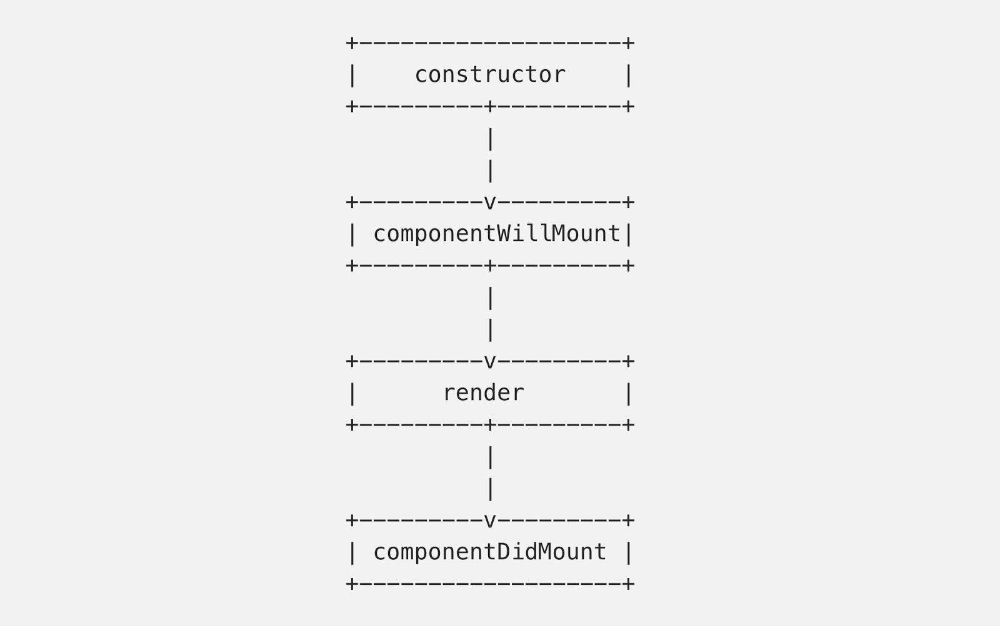
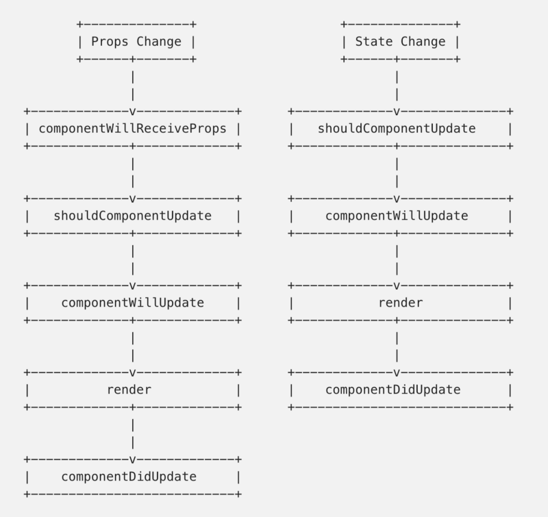

1 分钟读完 [I wish I knew these before diving into React](https://engineering.opsgenie.com/i-wish-i-knew-these-before-diving-into-react-301e0ee2e488)

# 我希望在深入 React 之前知道这些

[Canberk Morelli](https://engineering.opsgenie.com/@morellic) 是 OpsGenie 的一名前端工程师，正在使用 React 构建公司内部项目。
通过这篇文章可以使初学者不要犯同样的错误。

## 1、每次调用 `setState` 都会引起组件的重新渲染 re-render

每次**state 改变**或者**传入新的 props** 都会调用 `shouldComponentUpdate`。

`shouldComponentUpdate` 默认返回 `true`，开发者可以根据自己的逻辑决定是否返回 `false`。

注意：

- 不正确的 `shouldComponentUpdate` 逻辑可能引发错误：应该渲染的时候没有渲染，或者不应该渲染的时候却渲染了

- 在 `shouldComponentUpdate` 进行复杂的判断容易引发性能问题，可以通过 [React’s Performance Tools](https://reactjs.org/docs/perf.html) 来查找。

## 2、`setState` 对状态的改变是异步的

调用 `setState` 后，组件的 `state` 并**不会**立即改变。

一个经常犯的错误就是在 `setState` 后马上使用 `this.state`。

`setState` 还有另一种用法：`setState(updater, [callback])`，通过传递一个函数 `updater`。
第 2 个参数是修改完状态后的回调，但是不推荐在这里写业务逻辑，一个比较不错的地方是写到 `componentDidUpdate` 函数里。

## 3、组件生命周期很重要

生命周期大概分为 3 类：

**挂载**：组件被创建并插入到 DOM

**更新**：组件正在重新渲染，一般是由 props 或 state 的改变引起的

**卸载**：组件从 DOM 上移除

## 4、`componentWillReceiveProps` 的使用

当**组件的 props 改变时需要更新 state**时使用这个方法。

注意：

- 即使 props 没有改变，也会调用 `componentWillReceiveProps`，因此需要在函数内部比较 `this.props` 和 `nextProps`

- 在一个**已挂载**组件接收新 props 前，`componentWillReceiveProps` 被调用，因此在挂载阶段是**不会**调用 `componentWillReceiveProps` 的

## 5、使用 React Developer Tools

React Developer Tools 可以更方便的调试 React 应用。

## 6、使用 Create React App

官方推出的 Create React App 让开发者已**零配置**的方式快速创建 React 应用。

-----------

> 阅读原文：[I wish I knew these before diving into React](https://engineering.opsgenie.com/i-wish-i-knew-these-before-diving-into-react-301e0ee2e488)
>
> 讨论地址：[我希望在深入 React 之前知道这些](https://github.com/dev-reading/fe/issues/2)
> 
> 如果你想参与讨论，请[点击这里](https://github.com/dev-reading/fe)
