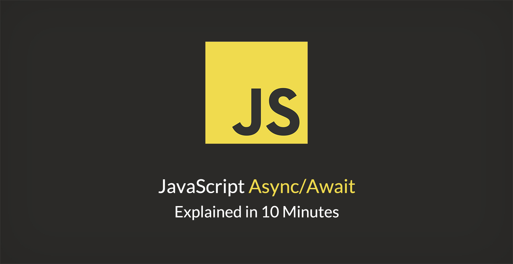

1 分钟读完 [JavaScript Async/Await Explained in 10 Minutes](https://tutorialzine.com/2017/07/javascript-async-await-explained)

# 10 分钟学会 JavaScript 的 Async/Await



以前我们使用 callback。

后来我们使用 Promise。

现在我们使用 Async/Await。

## 1、什么是 Async/Await？

Async - 定义异步函数(`async function someName(){...}`)

- 自动把函数转换为 Promise
- 当调用异步函数时，函数返回值会被 resolve 处理
- 异步函数内部可以使用 `await`

Await - 暂停异步函数的执行 (`var result = await someAsyncCall();`)

- 当使用在 Promise 前面时，`await` 等待 Promise 完成，并返回 Promise 的结果
- `await` **只能**和 Promise 一起使用，**不能**和 callback 一起使用
- `await` 只能用在 `async` 函数中

## 2、Async/Await 是否会取代 Promise

不会。

- Async/Await 底层依然使用了 Promise。
- 多个异步函数同时执行时，需要借助 `Promise.all`

```javascript
async function getABC() {
  let A = await getValueA(); // getValueA 花费 2 秒
  let B = await getValueB(); // getValueA 花费 4 秒
  let C = await getValueC(); // getValueA 花费 3 秒

  return A*B*C;
}
```

每次遇到 `await` 关键字时，Promise 都会停下在，一直到运行结束，所以总共花费是 2+4+3 = 9 秒。**`await` 把异步变成了同步**。

```javascript
async function getABC() {
  // Promise.all() 允许同时执行所有的异步函数
  let results = await Promise.all([ getValueA, getValueB, getValueC ]); 

  return results.reduce((total,value) => total * value);
}
```

函数总耗时为 4 秒（`getValueB` 的耗时）。

## 3、Async/Await 的错误处理

在 Async/Await 语法中，我们可以使用 try/catch 进行错误处理。在 Promise 中的 `.catch()` 分支会进入 `catch` 语句。 

-----------

> 阅读原文：[JavaScript Async/Await Explained in 10 Minutes](https://tutorialzine.com/2017/07/javascript-async-await-explained)
>
> 讨论地址：[10 分钟学会 JavaScript 的 Async/Await](https://github.com/dev-reading/fe/issues/3)
> 
> 如果你想参与讨论，请[点击这里](https://github.com/dev-reading/fe)
